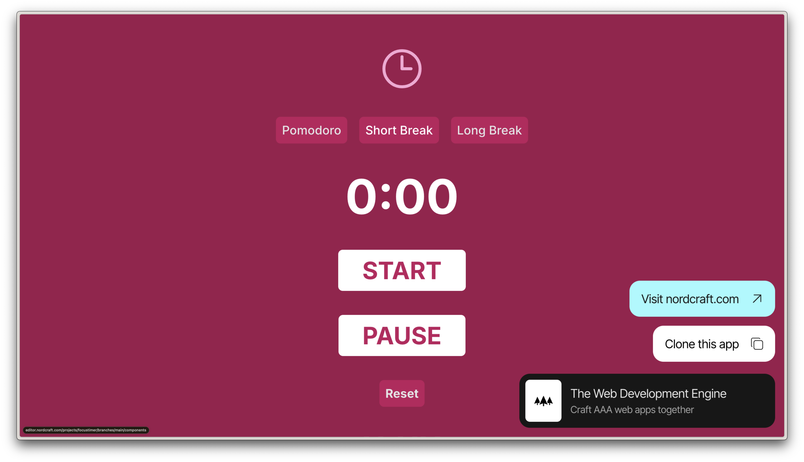

# Lesson 3: Build a Pomodoro timer

- [View the starter project and clone it to your Nordcraft account](https://focustimer_starter.toddle.site/)



- [View the finished project](https://focustimer.toddle.site/)
- [Open Lesson 3 (completed) in the Nordcraft editor](https://editor.nordcraft.com/projects/focustimer/branches/main/components/HomePage)

## URL to focus timer alert sound

```text
https://raw.githubusercontent.com/nordcraftengine/learn-nordcraft/main/lesson-3/focus_alert.mp3
```
