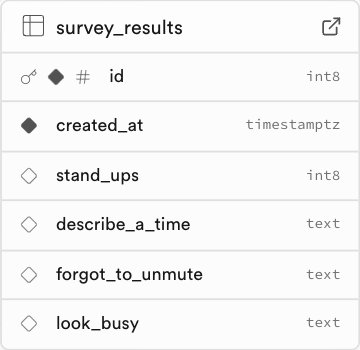

# Lesson 4: Build an Important Office Productivity Assessment Survey

- [View the finished project](https://productivity.toddle.site/)
- [Open Lesson 4 in the Nordcraft editor](https://editor.nordcraft.com/projects/productivity/branches/main/components/HomePage)

During this lesson, you will POST data collected in a multi-step form to a Supabase database.

## About the database

We have created a database for you to POST to, but you may wish to create your project and database in your own Supabase account. To do this:

1. [Sign up to Supabase](https://supabase.com/dashboard/sign-up)
1. Create a new project (name it e.g. `learn_nordcraft_office_productivity`)
1. Ensure Row Level Security (RLS) is enabled (this is on by default)
1. We will not be querying any data in this lesson, so you do not need to set a RLS policy. Without a RLS policy, `Select` queries may return an empty array of results.
1. Add the following columns to the database:

For more information, check out the [Supabase documentation](https://supabase.com/docs/guides/database/overview)