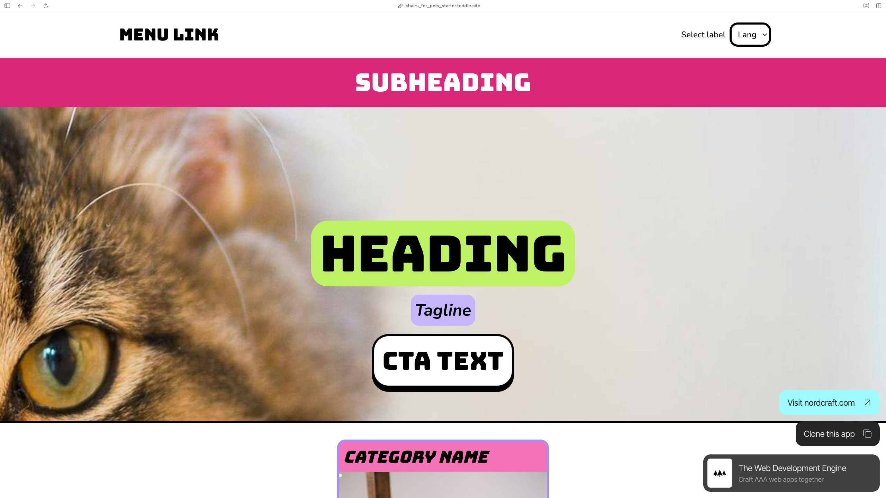

# Lesson 5: Build a multi-language website

- [View the starter project and clone it to your Nordcraft account](https://chairs_for_pets_starter.toddle.site/)



- [View the finished project](https://chairs_for_pets.toddle.site/)
- [Open Lesson 5 (completed) in the Nordcraft editor](https://editor.nordcraft.com/projects/chairs_for_pets/branches/main/components/HomePage)

During this lesson, you will use Nordcraft's native GraphQL explorer to build queries to fetch localized content from DatoCMS based on a given locale.

## Connect to DatoCMS

Use the following DatoCMS read-only token to connect to the DatoCMS project for this lesson:

```text
91230c45a1c0a034fdb6cd821c075f
```

We have created a schema and some example for you to use in this lesson, but you may wish to create your project in your own DatoCMS account. To do this, you'll need to set up the following schema in DatoCMS:

Example definition: `Field name / field type / allow localization`

## Menu link model

This is used to store links for the menu in the header, where the title of the link is localized.

1. Title / single-line string / yes
2. URL / slug / no
3. Order / order / no

## Hero model

This is used to store the image and localized text for the hero banner.

1. Heading / single-line string / yes
2. Subheading / single-line string / yes
3. CTA text / single-line string / yes
4. Tag line / single-line string / yes
5. Image / single asset / no

## Review model

This is used to store localized site reviews.

1. Name / single-line string / no
2. Avatar / single asset / no
3. Comment / single-line string / yes
4. Rating / integer number / now

## Copy model

This is used to store small bits of localized copy, such as for the language select label and the reviews section.

1. Section title / single-line string / yes
2. Section text / multiple-paragraph text / yes
3. Section slug / slug / no

## Category model

This is used to store product categories with localised text, including localized alt text for the images.

1. Title / single-line string / yes
2. Short description / single-line string / yes
3. Slug / slug / yes
4. Image / single asset / no

## Page model

This is used to store localized titles and meta descriptions for pages.

1. Title / single-line string / yes
2. Description / single-line string / yes
3. Slug / slug / no

For more information on getting started with DatoCMS and Nordcraft, check out our
[DatoCMS integration guide](https://docs.nordcraft.com/guides/datocms).
